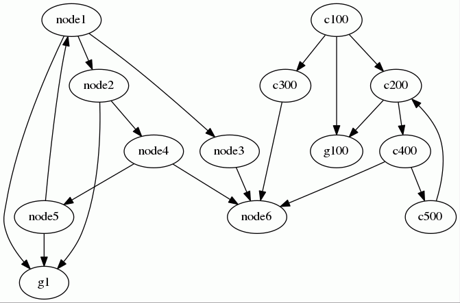

- [Introduction](#a0)
- [Graphs' types](#a1)
- [Graphs' representations](#a2)
  * [Directed graphs](#a3)
    + [Directed and unweighted](#a4)
    + [Directed and weighted](#a5)
  * [Undirected graphs](#a6)
    + [Undirected and unweighted](#a7)
    + [Undirected and weighted](#a8)
- [Graphs' API](#a9)
  * [Introduction](#a10)
  * [Loading a graph from a CSV file](#a11)
    + [Loading CSV with the default loader](#a12)
    + [Loading CSV with a customized loader](#a13)
  * [Dumping a graph into a CSV file](#a14)
    + [Dumping into CSV with the default dumper](#a15)
    + [Dumping into CSV with a customized dumper](#a16)
  * [Dumping a graph into its GraphViz representation](#a17)
- [Using the algorithms](#a18)
  * [The "Breadth First Search" algorithm](#a19)
    + [Synopsis](#a20)
  * [The "Depth First Search" algorithm](#a21)
    + [Synopsis](#a22)
  * [The Dijkstra's algorithm](#a23)
    + [Synopsis](#a24)
    + [Illustration](#a25)
  * [The Tarjan's algorithm](#a26)
    + [Synopsis](#a27)
    + [Illustration](#a28)


# <a name="a0"></a>Introduction

This repository contains the implementations of various algorithms for graphs.

* The [breadth-first search algorithm](https://en.wikipedia.org/wiki/Breadth-first_search) 
* The [depth-first search algorithm](https://en.wikipedia.org/wiki/Depth-first_search)
* The [Dijkstra's algorithm](https://en.wikipedia.org/wiki/Dijkstra's_algorithm)
* The [Tarjan's strongly connected components algorithm](https://en.wikipedia.org/wiki/Tarjan's_strongly_connected_components_algorithm)

# <a name="a1"></a>Graphs' types

Graphs may be:

* Directed or not.
* Weighted or not.

A given graph may be:

| Type of graph              | Class                                        |
|----------------------------|----------------------------------------------|
| Directed and unweighted    | `\dbeurive\Graph\lists\DirectedUnweighted`   |
| Directed and weighted      | `\dbeurive\Graph\lists\DirectedWeighted`     |
| Undirected and unweighted  | `\dbeurive\Graph\lists\UndirectedUnweighted` |
| Undirected and weighted    | `\dbeurive\Graph\lists\UndirectedWeighted`   |

# <a name="a2"></a>Graphs' representations

Many formalisms may be used to represent a graph. For example:

* Edge lists
* Adjacency matrices
* Adjacency lists

> This document presents various ways used to represent graphs:
> 
> [https://fr.khanacademy.org/computing/computer-science/algorithms/graph-representation/a/representing-graphs](https://fr.khanacademy.org/computing/computer-science/algorithms/graph-representation/a/representing-graphs)

This PHP module uses the formalism known as "Adjacency lists".

## <a name="a3"></a>Directed graphs

Vertices have __successors__ (and __predecessors__).

We can choose to describe the graph through its lists of successors or through its lists of predecessors.

### <a name="a4"></a>Directed and unweighted

Let's consider the following directed unweighted graph:


The agency lists can be represented by the associative array below: 

```php
array(
    'vertex1' => array('vertex2' => null, 'vertex5' => null),
    'vertex5' => array('vertex6' => null, 'vertex7' => null),
    'vertex2' => array('vertex3' => null),
    'vertex3' => array('vertex4' => null),
    'vertex4' => array('vertex2' => null)
)
```

Or by a CSV file:

    vertex1 vertex2 vertex5
    vertex5 vertex6 vertex7
    vertex2 vertex3
    vertex3 vertex4
    vertex4 vertex2

* The vertex `vertex1` has two successors: `vertex2` and `vertex5`.
* The vertex `vertex2` has one successor: `vertex3`.
* ...

See [this example](examples/directed-unweighted-in-memory.php).

### <a name="a5"></a>Directed and weighted

Let's consider the following directed weighted graph:


The agency lists can be represented by the associative array below: 

```php
array(
    'vertex1' => array('vertex2' => 1, 'vertex5' => 2),
    'vertex5' => array('vertex6' => 3, 'vertex7' => 4),
    'vertex2' => array('vertex3' => 5),
    'vertex3' => array('vertex4' => 6),
    'vertex4' => array('vertex2' => 7)
)
```

Or by a CSV file:

    vertex1 vertex2:1 vertex5:2
    vertex5 vertex6:3 vertex7:4
    vertex2 vertex3:5
    vertex3 vertex4:6
    vertex4 vertex2:7


* The vertex `vertex1` has two successors: `vertex2` and `vertex5`.
  * The weight associated to the edge from `vertex1` to `vertex2` is 1.
  * The weight associated to the edge from `vertex1` to `vertex5` is 2.
* The vertex `vertex2` has one successor: `vertex3`.
  * The weight associated to the edge from `vertex2` to `vertex3` is 5.
* ...

See [this example](examples/directed-weighted-in-memory.php).

## <a name="a6"></a>Undirected graphs

Vertices have __neighbours__.

### <a name="a7"></a>Undirected and unweighted

Let's consider the following undirected unweighted graph:


The agency lists can be represented by the associative array below:

```php
array(
    'vertex1' => array('vertex2' => null, 'vertex5' => null),
    'vertex5' => array('vertex6' => null, 'vertex7' => null),
    'vertex2' => array('vertex3' => null),
    'vertex3' => array('vertex4' => null),
    'vertex4' => array('vertex2' => null)
);
```
Or by the CV file:

    vertex1 vertex2 vertex5
    vertex5 vertex6 vertex7
    vertex2 vertex3
    vertex3 vertex4
    vertex4 vertex2

* The vertex `vertex1` has two neighbours: `vertex2` and `vertex5`.
* The vertex `vertex1` has two neighbours: `vertex6` and `vertex7`.
* ...

See [this example](examples/undirected-unweighted-in-memory.php).

### <a name="a8"></a>Undirected and weighted

Let's consider the following undirected weighted graph:


The agency lists can be represented by the associative array below:

```php
array(
    'vertex1' => array('vertex2' => 1, 'vertex5' => 2),
    'vertex5' => array('vertex6' => 3, 'vertex7' => 4),
    'vertex2' => array('vertex3' => 5),
    'vertex3' => array('vertex4' => 6),
    'vertex4' => array('vertex2' => 7)
);
```

Or by the CSV file:

    vertex1 vertex2:1 vertex5:2
    vertex5 vertex6:3 vertex7:4
    vertex2 vertex3:5
    vertex3 vertex4:6
    vertex4 vertex2:7

* The vertex `vertex1` has two successors: `vertex2` and `vertex5`.
  * The weight associated to the edge from `vertex1` to `vertex2` is 1.
  * The weight associated to the edge from `vertex1` to `vertex5` is 2.
* The vertex `vertex2` has one successor: `vertex3`.
  * The weight associated to the edge from `vertex2` to `vertex3` is 5.
* ...

See [this example](examples/undirected-weighted-in-memory.php).

# <a name="a9"></a>Graphs' API

## <a name="a10"></a>Introduction

The graph's API allows the following actions:

* Load a graph from a CSV file.
* Dump a graph into a CSV file.
* Create the [GraphViz](http://www.graphviz.org/) representation of a graph.
* "Complete" a graph's representation.
* For directed graphs: calculate the lists of predecessors from the lists of successors and vice versa.

Instead of presenting an-in depth description of the API, we will show examples of uses.

> Detailed API description can be generated using [phpDocumentor](https://www.phpdoc.org/).
> Just go to the root directory of this package and issue the following command: `phpdoc`.
> The documentation will be generated within the directory `doc/api`.

## <a name="a11"></a>Loading a graph from a CSV file

### <a name="a12"></a>Loading CSV with the default loader

Synopsis:

```php
$graph = new DirectedUnweighted(); // or DirectedWeighted
$graph->loadSuccessorsFromCsv($csvSuccessorsPath);
$graph->loadPredecessorsFromCsv($csvPredecessorsPath);

$graph = new UndirectedUnweighted(); // or UndirectedWeighted
$graph->loadNeighboursFromCsv($csvSuccessorsPath);
```

By default:

* Fields are separated by a space.
* Edges' weight is indicated by the character ':'.
* Vertices' names are loaded "as is".

Examples of standard CSV files:

    vertex1
    vertex2 vertex1 vertex4
    vertex5 vertex1
    vertex6 vertex5
    vertex7 vertex5
    vertex3 vertex2
    vertex4 vertex3

or:

    vertex1
    vertex2 vertex1:1 vertex4:7
    vertex5 vertex1:2
    vertex6 vertex5:3
    vertex7 vertex5:4
    vertex3 vertex2:5
    vertex4 vertex3:6

See example [from-csv-directed-unweighted.php](examples/from-csv-directed-unweighted.php).

See example [from-csv-directed-weighted.php](examples/from-csv-directed-weighted.php).

See example [from-csv-undirected-unweighted.php](examples/from-csv-undirected-unweighted.php).

See example [from-csv-undirected-weighted.php](examples/from-csv-undirected-weighted.php).

### <a name="a13"></a>Loading CSV with a customized loader

Synopsis:

```php
$graph = new DirectedUnweighted(); // or UndirectedUnweighted
$graph->setFieldSeparator(';');
$graph->setVertexUnserializer(function($inVertex) { return strtoupper($inVertex); });
$graph->setLinePreProcessor(function($inLine) { return trim($inLine); });

$graph = new DirectedWeighted(); // or UndirectedWeighted
$graph->setFieldSeparator(';');
$graph->setVertexUnserializer(function($inVertex) { return strtoupper($inVertex); });
$graph->setLinePreProcessor(function($inLine) { return trim($inLine); });
$graph->setWeightIndicator('::');
```

While loading CSV files, it is possible to specify non-standard attributes:

* The field separator. The default field separator is the space (" ").
* The weight indicator (for weighted graphs only). The default weight indicator is the character ":".

It is also possible to specify actions applied to the following data:

* The vertices' names.
* The line of CSV (for example, you can remove leading and trailing spaces).

> Actions are specified via a "callable" (see [this explanation](http://php.net/manual/en/language.types.callable.php)).

In the following examples:

* We changed the field separator (we use ";" instead of " ").
* We changed the weight indicator (we used "::" instead of ":").
* We convert vertices' names into uppercase.
* We remove leading and trailing spaces from each line before any other process.

See example [from-csv-directed-unweighted-non-standard.php](examples/from-csv-directed-unweighted-non-standard.php).

See example [from-csv-directed-weighted-non-standard.php](examples/from-csv-directed-weighted-non-standard.php).

## <a name="a14"></a>Dumping a graph into a CSV file

### <a name="a15"></a>Dumping into CSV with the default dumper

Synopsis:

```php
$graph = new DirectedUnweighted();        // Or DirectedWeighted
$graph->setSuccessors($listOfSuccessors); // You can also set the lists of predecessors.
$graph->dumpSuccessorsToCsv($csvPath);    // You can also dump the lists of predecessors.

$graph = new UndirectedUnweighted();      // Or UndirectedWeighted
$graph->setNeighbours($listOfNeighbours);
$graph->dumpNeighboursToCsv($csvPath);
```

See example [to-csv-directed-unweighted.php](examples/to-csv-directed-unweighted.php).

See example [to-csv-directed-weighted.php](examples/to-csv-directed-weighted.php).

See example [to-csv-undirected-unweighted.php](examples/to-csv-undirected-unweighted.php).

See example [to-csv-undirected-weighted.php](examples/to-csv-undirected-weighted.php).

### <a name="a16"></a>Dumping into CSV with a customized dumper

Synopsis:

```php
// Directed Weighted

$graph = new DirectedWeighted();
$graph->setSuccessors($listOfSuccessors);
$graph->calculatePredecessorsFromSuccessors();
$graph->setFieldSeparator(';');
$graph->setVertexSerializer(function($inVertex) { return strtoupper($inVertex); });
$graph->setWeightIndicator('::');
$graph->dumpSuccessorsToCsv($csvPath);
$graph->dumpPredecessorsToCsv($csvPath);

// Directed Unweighted

$graph = new DirectedUnweighted();
$graph->setSuccessors($listOfSuccessors);
$graph->calculatePredecessorsFromSuccessors();
$graph->setFieldSeparator(';');
$graph->setVertexSerializer(function($inVertex) { return strtoupper($inVertex); });
$graph->dumpSuccessorsToCsv($csvPath);
$graph->dumpPredecessorsToCsv($csvPath);

// Undirected Weighted

$graph = new UndirectedWeighted();
$graph->setFieldSeparator(';');
$graph->setWeightIndicator('::');
$graph->setVertexSerializer(function ($inVertex) { return strtoupper($inVertex); } );
$graph->setNeighbours($listOfNeighbours);
$graph->dumpNeighboursToCsv($csvPath);

// Undirected Unweighted

$graph = new UndirectedUnweighted();
$graph->setFieldSeparator(';');
$graph->setVertexSerializer(function ($inVertex) { return strtoupper($inVertex); } );
$graph->setNeighbours($listOfNeighbours);
$graph->dumpNeighboursToCsv($csvPath);
```

While dumping CSV files, it is possible to specify non-standard attributes:

* The field separator. The default field separator is the space (" ").
* The weight indicator (for weighted graphs only). The default weight indicator is the character ":".

It is also possible to specify actions applied to the following data:

* The vertices' names.

> Actions are specified via a "callable" (see [this explanation](http://php.net/manual/en/language.types.callable.php)).

See example [to-csv-directed-unweighted-non-standard.php](examples/to-csv-directed-unweighted-non-standard.php).

See example [to-csv-directed-weighted-non-standard.php](examples/to-csv-directed-weighted-non-standard.php).

See example [to-csv-undirected-unweighted-non-standard.php](examples/to-csv-undirected-unweighted-non-standard.php).

See example [to-csv-undirected-weighted-non-standard.php](examples/to-csv-undirected-weighted-non-standard.php).

## <a name="a17"></a>Dumping a graph into its GraphViz representation

Synopsis:

```php
$graph = new DirectedUnweighted(); // or DirectedWeighted
$graph->setSuccessors($listOfSuccessors);
$txt = $graph->dumpSuccessorsToGraphviz();
$graph->calculatePredecessorsFromSuccessors();
$txt = $graph->dumpPredecessorsToGraphviz();

$graph = new UndirectedUnweighted(); // or UndirectedWeighted
$graph->setNeighbours($listOfNeighbours);
$txt = $graph->dumpNeighboursToGraphviz();
```

> Please note that the generated GraphViz representation is highly customisable.
> The methods `dumpSuccessorsToGraphviz`, `dumpPredecessorsToGraphviz` and `dumpNeighboursToGraphviz` take parameters.
> These parameters allow you to customise the appearances of the vertices and of the edges.

See example [to-graphviz-directed-unweighted.php](examples/to-graphviz-directed-unweighted.php).

See example [to-graphviz-directed-weighted.php](examples/to-graphviz-directed-weighted.php).
 
See example [to-graphviz-undirected-unweighted.php](examples/to-graphviz-undirected-unweighted.php).
 
See example [to-graphviz-undirected-weighted.php](examples/to-graphviz-undirected-weighted.php).

# <a name="a18"></a>Using the algorithms

## <a name="a19"></a>The "Breadth First Search" algorithm

See the description [here](https://en.wikipedia.org/wiki/Breadth-first_search).

### <a name="a20"></a>Synopsis

```php
$vertices = array();

// Define a callback that will be executed for each visited vertex.
// * If the function returns true, then the exploration of the graph continues.
// * If the function returns false, then the exploration of the graph ends.

$callback = function($inVertex) use(&$vertices) {
    $vertices[] = $inVertex;
    return true;
};

// For directed graphs

$graph = new DirectedUnweighted(); // or DirectedWeighted
$graph->setSuccessors($successors, true);
$graph->calculatePredecessorsFromSuccessors();
$algo = new DirectedBreadthFirstSearch($graph, $callback);
$algo->followSuccessors();
$algo->run('e1', $callback); // Start traversing the graph from the vertex 'e1', following the sucessors.
$algo->followPredecessors();
$algo->run('e1', $callback); // Start traversing the graph from the vertex 'e1', following the predecessors.

// For undirected graphs

$graph = new UndirectedUnweighted(); // or UndirectedWeighted
$graph->setNeighbours($successors, true);
$algorithm = new UndirectedBreadthFirstSearch($graph, $callback);
$algorithm->run('e1', $callback); // Start traversing the graph.
```

> Please note that this algorithm works for directed **and undirected** graphs.

> Please note that the returned value of the callback function (`$callback`) determines the behaviour of the method `run()`.
>
> * If the callback function returns the value true, then the method `run()` continues the traversal of the graph.
> * If the callback function returns the value false, then the method `run()` stops the traversal of the graph.

See example [breadth-first-search-directed.php](examples/breadth-first-search-directed.php).

See example [breadth-first-search-undirected.php](examples/breadth-first-search-undirected.php).

## <a name="a21"></a>The "Depth First Search" algorithm

See the description [here](https://en.wikipedia.org/wiki/Depth-first_search).

### <a name="a22"></a>Synopsis

```php
$vertices = array();

// Define a callback that will be executed for each visited vertex.
// * If the function returns true, then the exploration of the graph continues.
// * If the function returns false, then the exploration of the graph ends.

$callback = function($inVertex) use(&$vertices) {
    $vertices[] = $inVertex;
    return true;
};

// For directed graphs

$graph = new DirectedUnweighted(); // Or DirectedWeighted 
$graph->setSuccessors($successors, true);
$graph->calculatePredecessorsFromSuccessors();
$algo = new DirectedDepthFirstSearch($graph, $callback);
$algo->followSuccessors();
$algo->run('e1', $callback); // Start traversing the graph from the vertex 'e1', following the successors.
$algo->followPredecessors();
$algo->run('e1', $callback); // Start traversing the graph from the vertex 'e1', following the predecessors.
```

> Please note that this algorithm works for directed **and undirected** graphs.

> Please note that the returned value of the callback function (`$callback`) determines the behaviour of the method `run()`.
>
> * If the callback function returns the value true, then the method `run()` continues the traversal of the graph.
> * If the callback function returns the value false, then the method `run()` stops the traversal of the graph.

See example [depth-first-search-directed.php](examples/depth-first-search-directed.php).

See example [depth-first-search-undirected.php](examples/depth-first-search-undirected.php).

## <a name="a23"></a>The Dijkstra's algorithm

See the description [here](https://en.wikipedia.org/wiki/Dijkstra's_algorithm).

* This algorithm works for both directed and undirected graphs.
* The graph must be weighted.

### <a name="a24"></a>Synopsis

```php
// With directed graphs

$graph = new DirectedWeighted();
$graph->setSuccessors($successors, true);
$algorithm = new DirectedDijkstra($graph);
$algorithm->followSuccessors();
$distances = $algorithm->run($vertexName); // Start the algorithm.
$txt = $algorithm->dumpToGraphviz(); // For a nice representation of the result.

// With undirected graphs

$graph = new UndirectedWeighted();
$graph->setNeighbours($neighbours, true);
$algorithm = new UndirectedDijkstra($graph);
$distances = $algorithm->run($vertexName);
$txt = $algorithm->dumpToGraphviz(); // For a nice representation of the result.
```

See example [dijkstra-directed.php](examples/dijkstra-directed.php).

See example [dijkstra-undirected.php](examples/dijkstra-undirected.php).

### <a name="a25"></a>Illustration

Given the graph below, let's find the shortest paths from the vertex "`1`" to all other vertices.
 


After running the algorithm, we get:


* The shortest distance between vertex "`1`" and vertex "`3`" is 9.
* The shortest distance between vertex "`1`" and vertex "`6`" is 11.
* The shortest distance between vertex "`1`" and vertex "`5`" is 20.
* ...

Shortest paths are printed in red. 

## <a name="a26"></a>The Tarjan's algorithm

See the description [here](https://en.wikipedia.org/wiki/Tarjan's_strongly_connected_components_algorithm).

* This algorithm works for both directed graphs only.
* The graph may be weighted or not.

### <a name="a27"></a>Synopsis

```php
$graph = new DirectedUnweighted(); // or DirectedWeighted
$graph->setSuccessors($successors, true);

$algorithm = new DirectedTarjan($graph);
$algorithm->followSuccessors();
$scc = $algorithm->run();
$cycles = $algorithm->getCycles();
$txt = $algorithm->dumpToGraphviz(); // For a nice representation of the result.
```

See example [tarjan.php](examples/tarjan.php).

### <a name="a28"></a>Illustration

Given the graph below, let's find all the cycles:



After running the algorithm, we get:


> Please note that this algorithm does not return the list of cycles within the graph.
> It returns the list of _strongly connected components_.
> However, cycle detection is an application of this algorithm.
> Here, we choose to show the result of the method `getCycles()`.